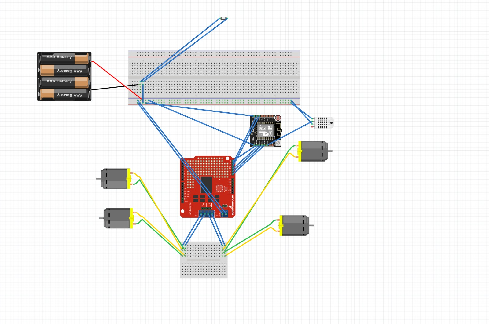
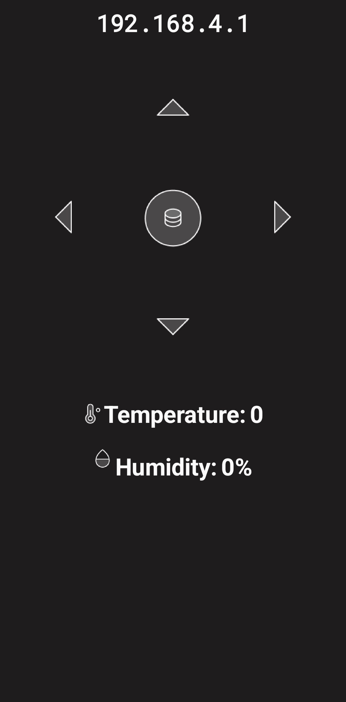
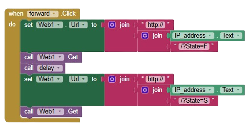
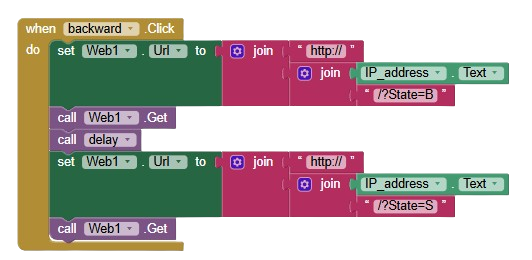
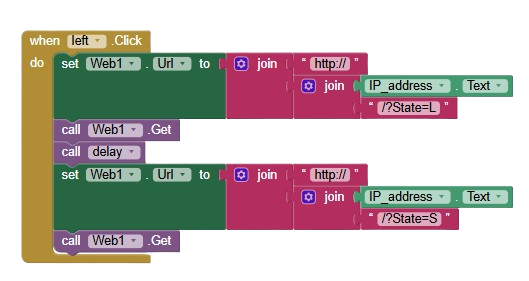
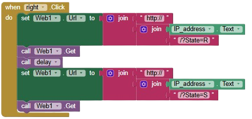
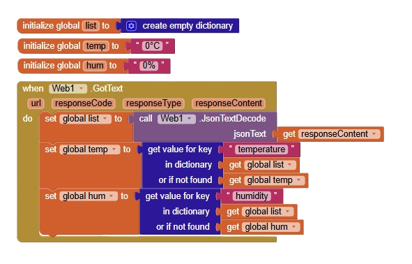
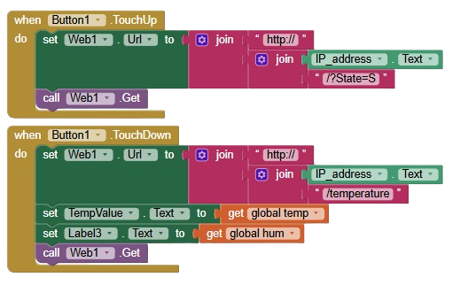
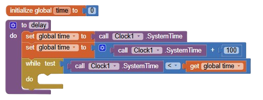

# temperature-autobot
## Introduction

The WiFi Robot Car with Environmental Monitoring is a project that combines robotics and IoT. It allows users to remotely control a robot car and monitor environmental data, including temperature and humidity, in real time.

---

## Features

- **WiFi-Controlled Movement**: Control the robot's movements (forward, backward, left, right) using a web-based interface.
- **Environmental Monitoring**: Real-time retrieval of temperature and humidity data from the DHT11 sensor.
- **User-Friendly Interface**: Includes Scratch-like blocks for easy understanding of the logic.

---

## Components Used

### Hardware
1. **ESP8266 WiFi Module**: For communication and control.
2. **DHT11 Sensor**: Measures temperature and humidity.
3. **L298N Motor Driver**: Controls motor speed and direction.
4. **DC Motors and Chassis**: Provides mobility.
5. **Power Supply**: Powers the components.
6. **Additional Components**: Breadboard, jumper wires, resistors.

### Images
- **Main View of Robot**:
  

- **Top View of Robot**:
  
  
- **Breadboard Assembly**:
  
  
- **Engine View**:
  

- **Circuit Schematic**:
  
---

## User Interface and Logic

The robot is controlled using an intuitive web interface with buttons for each movement direction and a center button to retrieve environmental data.

### Interface View

### Logic Blocks
- **Forward Movement**:
  
- **Backward Movement**:
  
- **Left Turn**:
  
- **Right Turn**:
  
- **Environmental Data Initialization**:
  
- **Environmental Data Retrieval**:
  
- **Delay Logic**:
  

---

## How It Works

1. **Control Movement**:  
   Use the forward, backward, left, and right buttons to send HTTP commands to the ESP8266, which moves the car in the desired direction.

2. **Retrieve Environmental Data**:  
   The center button fetches temperature and humidity data from the DHT11 sensor and displays it on the interface.

3. **Connection**:  
   - The ESP8266 creates a WiFi access point.
   - Connect your device to the WiFi network.
   - Use the interface to send commands and fetch data.

---

## Assembly

1. Assemble the components as shown in the **Breadboard Assembly** and **Circuit Schematic** images.
2. Attach the motors and chassis as shown in the **Engine View** and **Top View** images.

---

## Challenges and Improvements

### Challenges
- Maintaining stable WiFi connectivity.
- Fine-tuning motor control for smooth movements.
- Addressing variations in sensor readings.

### Potential Improvements
- Add obstacle detection and avoidance using ultrasonic sensors.
- Integrate video streaming for real-time navigation.
- Expand environmental monitoring capabilities.

---

## How to Use

1. Assemble the hardware components.
2. Flash the Arduino code (`esp-code.ino`) to the ESP8266.
3. Power up the robot and connect your device to the ESP8266 WiFi network.
4. Open the web interface to control the car and retrieve data.

---

## License

This project is open-source and free for educational purposes. Contributions are welcome!

---
